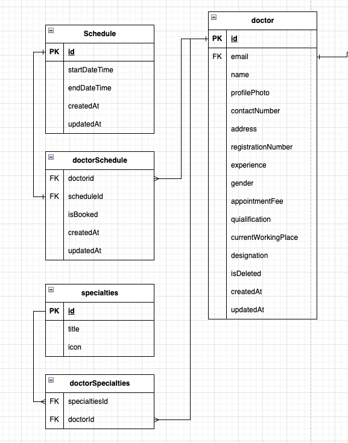

## Task-1: Doctor Specialties Management Module

### Objective

In this task, you will implement **Specialties Management** and **Doctor Profile Management** features in your existing project.
You will create APIs to manage **medical specialties**, assign them to **doctors**, and update doctor information with specialty relationships.

---

## Database Schema



### **Model: Specialties**

```prisma
model Specialties {
  id                String              @id @default(uuid())
  title             String
  icon              String
  doctorSpecialties DoctorSpecialties[]

  @@map("specialties")
}
```

### **Model: DoctorSpecialties**

```prisma
model DoctorSpecialties {
  specialitiesId String
  specialities   Specialties @relation(fields: [specialitiesId], references: [id])

  doctorId String
  doctor   Doctor @relation(fields: [doctorId], references: [id])

  @@id([specialitiesId, doctorId])
  @@map("doctor_specialties")
}
```

---

## Module 1: Specialties Management

You need to build the following APIs for the **Specialties** module.

### **1. POST /specialties**

**Purpose:** Create a new specialty with an image.
**Request Type:** `multipart/form-data`

**Request Body Example:**

```
file: image.png
data: {
  "title": "Medicine"
}
```

**Example Endpoint:**
`{{BASE_URL}}/specialties`

---

### **2. GET /specialties**

**Purpose:** Get all specialties with filtering, searching, pagination, and sorting options.

**Example Query Parameters:**

```
{{BASE_URL}}/specialties?search=Medicine&page=1&limit=10&sortBy=title&sortOrder=asc
```

**Supported Features:**

* ✅ Search by title
* ✅ Filter by field
* ✅ Pagination (`page`, `limit`)
* ✅ Sorting (`sortBy`, `sortOrder`)

---

### **3. DELETE /specialties/:id**

**Purpose:** Delete a specific specialty by ID.

**Example Endpoint:**
`{{BASE_URL}}/specialties/71e84272-2b32-47b5-a006-4a797e6bc545`

---

## Module 2: Doctor Management

You will extend the existing **Doctor** module to:

* Update doctor profile details.
* Assign multiple specialties to a doctor.
* Add or remove specialties dynamically.

---

### **4. PATCH /doctor/:id**

**Purpose:** Update doctor profile information and manage assigned specialties.

**Example Endpoint:**
`{{BASE_URL}}/doctor/990cd5cf-28bd-4018-a119-50b70befede6`

**Request Body Example:**

```json
{
  "name": "Dr. Cameron Williamson",
  "contactNumber": "+1234567899",
  "address": "123/A Medical Street, Cityville",
  "registrationNumber": "1234560",
  "experience": 6,
  "gender": "MALE",
  "apointmentFee": 200,
  "qualification": "MBBS (BCS)",
  "currentWorkingPlace": "City Medical College Hospital",
  "designation": "Senior Consultant",
  "specialties": [
    {
      "specialtiesId": "b7c2447c-4eb7-45c5-b7b9-d4e80a797540",
      "isDeleted": false
    }
  ]
}
```

**Notes:**

* When `"isDeleted": false` → assign this specialty to the doctor.
* When `"isDeleted": true` → remove this specialty from the doctor.
* All other profile fields are optional but can be updated if provided.

---

## Implementation Hints

* Use **Prisma ORM** for all database operations.
* Use **Multer** (or similar library) for file upload.
* Store only the **image file path or URL** in the database.
* Apply **input validation** (e.g., Zod or Joi).
* Maintain proper **error handling** and **HTTP response codes**.
* Ensure **clean modular code structure** (separate routes, controllers, and services).

---

## Bonus (Optional)

* Implement **soft delete** for specialties instead of permanent deletion.
* Add **createdAt** and **updatedAt** timestamps for better tracking.
* Implement a **search suggestion API** for specialties.

---

## Expected Deliverables

1. Functional APIs for:

   * `POST /specialties`
   * `GET /specialties`
   * `DELETE /specialties/:id`
   * `PATCH /doctor/:id`
2. Properly tested using **Postman** or **Thunder Client**.
3. Clean and readable code following project conventions.
